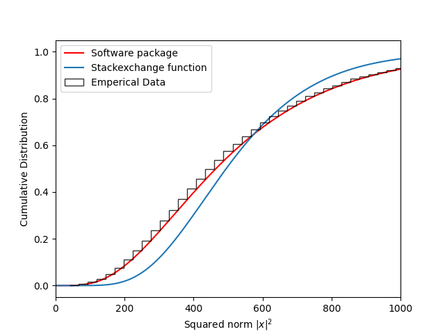

## Der skal formuleres
- Projekt Titel
- Projekt beskrivelse (ikke en problemformulering, selvom denne nok vil være den mest beskrivende)
    - Der er altså ingen binding til problemformulering

## Aftalt med vejleder
- Hvor ofte vi skal mødes (hvor lange disse møder skal være) 
    - Vi har vel 8-9 uger
    - Hvor mange timer der vejledes
- Hvad der forventes af vejleder til disse møder
- Hvad der forventes af mig til disse møder
- Kommunikationsform - altså uden for møder (mail/teams etc.)

## Andet praktisk
- Jeg skriver på engelsk
- 7.5 etcs (10 etcs hvis det er nødvendigt for at lave noget jeg gerne vil)

- Når aftalerne er på plads laver jeg en kontrakt som vi underskriver og jeg indsender den til uddannelse@diku.dk, som efterfølgende vil indhente den endelige godkendelse fra studielederen.

## Review and noise investigation of the Elliptical Gaussian Mechanism

The report will consist of two parts
1. A review of the differentially private algorithm 'Elliptical Gaussian Mechanism' created by Rasmus Pagh and Christian (I don't know his surname) and theoretical results of the mechanism.
2. An investigation of the noise introduced by the algorithm. This is done either by creating synthetic datasets and then analysing the norm of the noise, or through a theoretic investigation of norm of the noise.

#### Second edition:
The report will consist of two parts:

A review of central termonology and theorems in differential privacy, then followed by covering aspects of the article 'Private Vector Aggregation when Coordinates have Different Sensitivity" written by Rasmus Pagh and Christian Lebeda.
I will be focusing on the 'Elliptical Gaussian Mechanism' (EGM) and when covering termonology and theorems from differential privacy I will specifically focus on those which relate to the EGM.

As the EGM expects data to lie within pre-specified bounds I will in the second part of the project investigate how to apply the EGM when data is assumed to come from a multivariate normal distribution instead. This investigation can include:
- Details on how privacy can be preserved
- Giving bounds for the expected l2-error
- An emperical evaulation of the method in this setting

### Meeting plans
- I need not introduce the Gaussian distribution, but perhaps some results which are of importance to the project
- How do I proceed if I have to do it numerically?
- Should I write about the litterature and which cases that have a closed formular? i.e. cover non-central chi-square 

It seems as though the expression is simply not correct from experiments.
$$ \sigma \in (1,11) $$
$$ \#\text{samples} = 10000 $$
$$ d = 10 $$ 

##### Previous
- I have looked at using Chebyshev's inequality for the constraint, though it is a very complicated problem constraint then.
- I will proceed with expectation 1. And then use either chebyshev's inequality to decide bound on removal of data.
- I could also use numerical methods to evaluate the CDF, but if I do, shouldn't I include explanation of how these methods work? Some of them seem quite complex and written in the 80's.
- I will (attempt to) solve the problem with expected 1, within the next week, and discuss that next week.
- Next week is the last before break, so it would be nice to have an idea on the majority.
- I can quite easily extend the majority of the work to any $p$. I.e. any norm, though evaluating the CDF and when to clip is only available in when $p$ is even.
- Should I explain lagrangian multipliers?
- I would like to have a draft of something after new years which you can gauge the level of depth. Perhaps skip next meeting and use that time for the reading.

Bernstein inequality
- Model constraint with this equality
    - Don't solve it if complicated
    - Use this to construct upper bound on error
    - Mention that in reality the CDF can be evaluated numerically

##### Next
- How do I handle $c_i$, the max limit on all dimensions, if I set that only 0.0001 fraction of points are outside, then is clipping these alright? Otherwise I have no clue on how to set the bound
- Proofs of theorems from other sources (both your article and other)?

Davies algorithm for estimating the CDF of generalized chi square. Used by the python package, it has absolute error tolerance as a parameter
https://www.jstor.org/stable/pdf/2346911.pdf?refreqid=excelsior%3A9cdee81fcfde8b00397063d6f08d5f06&ab_segments=&origin=&acceptTC=1

### TODO:
- Make argument for why clipping data preserves privacy. Should be closely related to definition of ($\epsilon$,$\delta$)-DP.
- Think about transforming data such that expected norm is $1$ (in theory anything such that anything outside this is clipped). This is related to generalized chi square distributions.

Let $x$ be multivariate normally distributed,
then
$$ <x,x> = x^Tx = \| x\|^2$$
$$ E[\| x \|^2] = tr[\Sigma] + \| \mu \|^2 $$
$$ var[\| x \|^2] = 2 tr[\Sigma \Sigma] + 4\mu^T\Sigma\mu$$ 

I can always transform a normal random variable to standard normal variable by
$$ X \sim N(\mu,\sigma^2)$$
$$\frac{X-\mu}{\sigma} \sim N(0,1)$$
Generalized Chi square is defined as the linear sum of indpendent noncentral chi-square variables
$$ \xi = \sum_{i} w_i x_i $$ 
where each $x_i \sim \sum_{j} X_j^2$, and $X_j \sim N(\mu_j,1)$

so in my case $j=1$ and 
$$ \xi = \sum_i w_i X_i^2$$
Is it hen correct to set $w_i = \sigma_i^2$, as $\sigma_i X_i \sim N(\mu_i, \sigma_i^2)$

From initial experiments it seems as though the following function fits quite well
$$ f(x) = \sum_{i=1}^k \frac{e^{-\frac{x}{\sigma_i^2}}}{\sigma_i^2 \prod_{j=1,j\ne i}(1 - \frac{\sigma_j^2}{\sigma_i^2})} $$
found from https://math.stackexchange.com/questions/605267/length-of-gaussian-random-vector

Definitive cumulative density function is then given by
$$ \int_0^t f(x) =
 \sum_{i=1}^k \frac{-\sigma_i^2 e^{-\frac{t}{\sigma_i^2}}}{\sigma_i^2 \prod_{j=1,j\ne i}(1 - \frac{\sigma_j^2}{\sigma_i^2})}  + 1 =
1 -\sum_{i=1}^k \frac{e^{-\frac{t}{\sigma_i^2}}}{\prod_{j=1,j\ne i}(1 - \frac{\sigma_j^2}{\sigma_i^2})} $$
The $+1$ comes from the fact that $F(0)=-1$, which is not quite obvious but from toy example it is true. 
I need to determine $t$ s.t. $\int_0^t f(x) = 0.95$.
Actually I need to determine a transformation s.t. $t = 1$.

Reading more into it, it is mentioned that here the $X_i$ are complex normal random variables.

I assume $\mu = 0$.

I have in Mathai-Provost page. 95 found the infinite expression:
(Theorem 4.2b.1)
$$ Pr[X^2 \le t] = F(t) = \sum_{k=0}^{\infty}(-1)^k \cdot c_k \cdot \frac{t^{\frac{p}{2} + k -1}}{\Gamma(\frac{p}{2} +k)}$$ 

where
$$ p = \# \text{Dimensions} $$
$$ c_0 = \exp \left(- \frac{1}{2} \cdot \sum_{j=1}^p b_j^2 \right) \cdot \prod_{j=1}^p(2\lambda_j)^{-\frac{1}{2}} $$
in our case $b_j = 0$ and $\lambda_j = \sigma_j^2$, thus
$$ c_0 = \prod_{j=1}^p( \frac{1}{\sqrt{2\sigma_j^2}}) 
= \prod_{j=1}^p( \frac{1}{\sqrt{2}\sigma_j})
$$

$$ c_k = \frac{1}{k} \cdot \sum_{r=0}^{k-1} d_{k-r} c_r $$
$$ d_k = \frac{1}{2} \sum_{j=1}^{p} (2\lambda_j)^{-k} 
= \frac{1}{2} \sum_{j=1}^p \frac{1}{(2\sigma_j^2)^k}
$$

Writing list
- Introduction and the problem (informal)
- Prerequisites (definitions/theorems)
- The Problem and Algorithms 
    - Gaussian Mechanism
    - Problem of adding equal noise in each dimension
    - Elliptical Gaussian Mechanism 
        - Look at this as a transformation to symmetry (i.e. equal noise here is optimal)
- Problem of Gaussian data 
    - Clipping data (such that very little is removed 10^5 points and 10^{-5} prob of clipping points)
    - Transition into symmetry again
- Different ways of solving, setup different constraints
- Present the one focused on and the steps to solving it
- Theorem on optimality
- Theorem on error
- Discuss bounds for $\alpha$ and numerical solutions
    - Using Chebyshevs
    - Using Bernsteins

